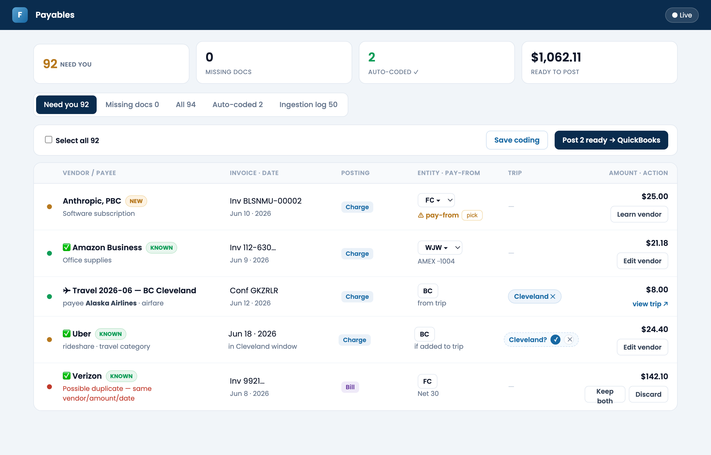
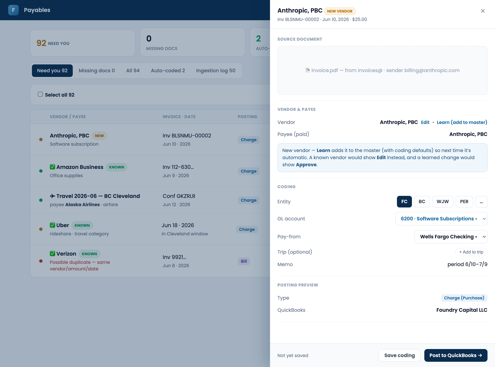
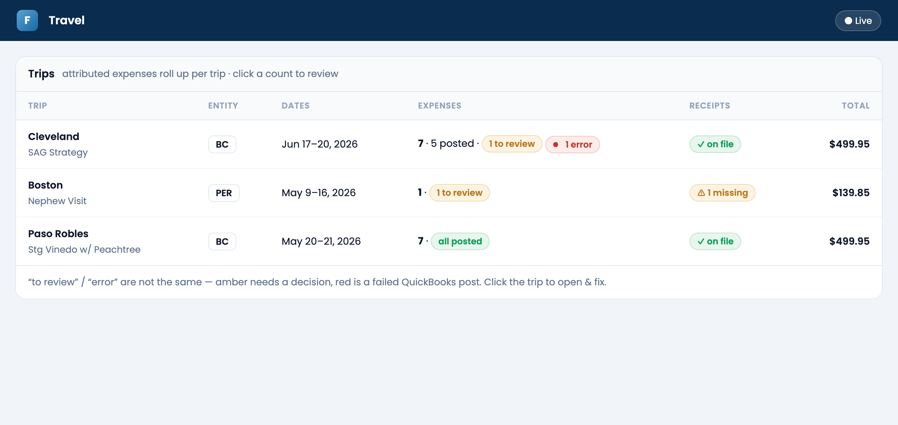
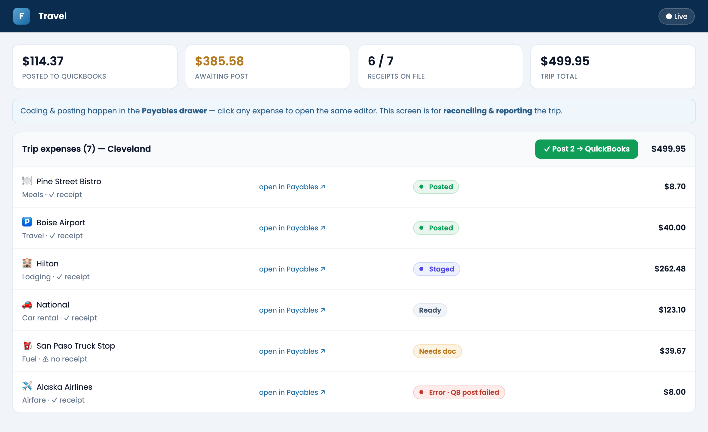
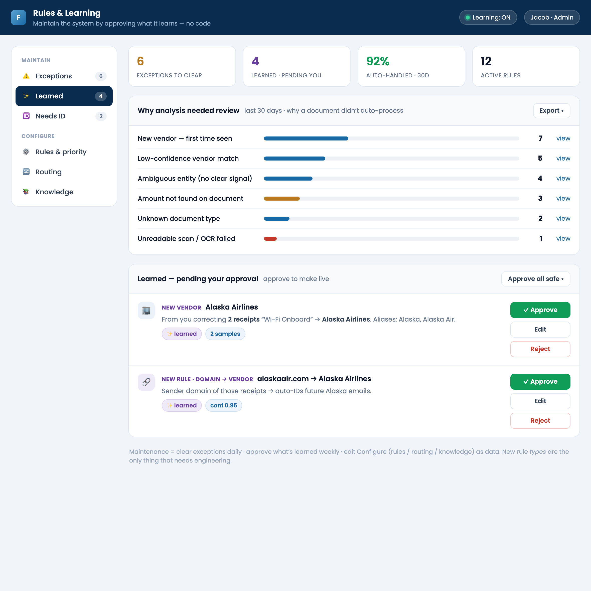
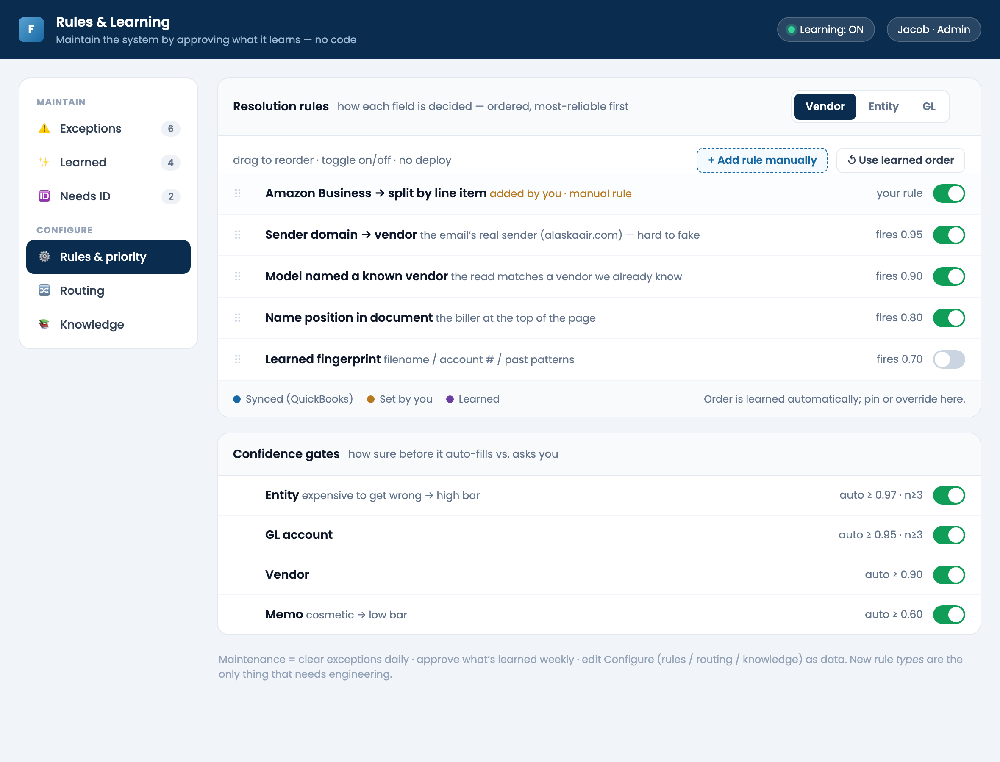
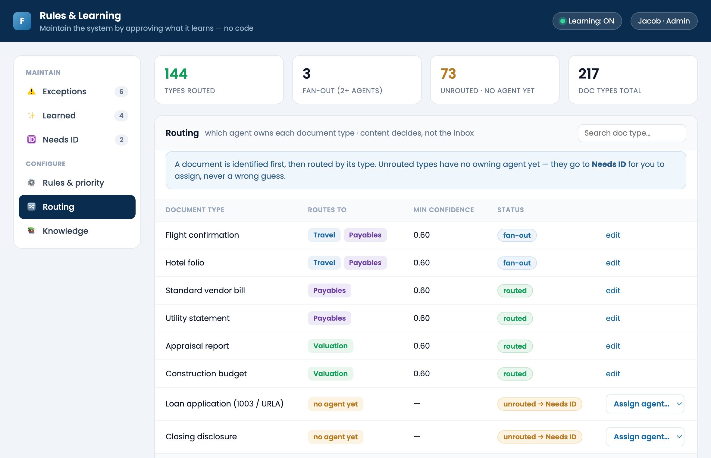
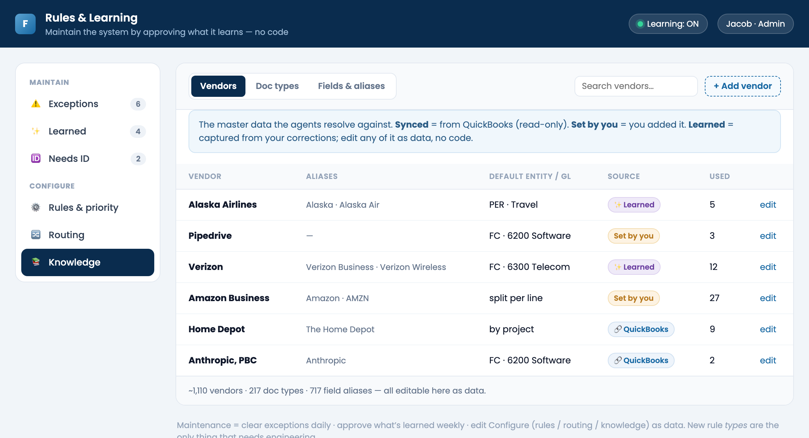

# Agent Portal — User Manual

Operator's guide to every screen, button, and field. Each control lists **what it does** and
the **handler/route** that backs it (so behavior is verifiable in code, not assumed). Last
updated for the UX overhaul (vendor-state badges, payee/posting display, Save-vs-Post, Trip
field, trips three-states, shared drawer, Rules & Learning console).

Verification basis: every button below is wired to the named handler in `components/…` or the
named route in `app/api/…`. "Works as designed" = the control invokes that handler and the
handler performs the described effect. Items needing backend not yet built are marked **(pending
backend)**.

---

## Navigation (`components/nav.ts`)
Left sidebar, three sections:
- **Operations:** Dashboard · Inbox · Review Queue · Monitoring
- **Agents:** Payables · Travel · Bookkeeper · Valuation
- **Settings:** **Rules & Learning** (new) · Admin

One SSO login at the portal; modules never prompt again.

---

## Payables (`components/payables/Payables.tsx`)
The daily queue: clear what the agent couldn't resolve, then post to QuickBooks.

**The queue**

**The transaction drawer**

### Top bar
- **Get from Plaid (soon)** — placeholder, disabled.
- **Upload CSV / QBO** — bank/card statement import → ingestion.
- **Upload invoices** — file picker → Storage + `ingestion_jobs` → worker processes (`uploadInvoices`).
- **Reprocess vendors** — re-runs vendor matching on the queue (`reprocess` route).

### Summary stats (read-only)
Need you · Missing docs · Auto-coded ✓ · Ready to post ($).

### Tabs
Need you · Missing docs · All · Auto-coded · Ingestion log — filter the list.

### Bulk bar
- **Select all N** — checkbox selects the filtered set.
- **Save coding** — persists coding on selected rows (reversible; nothing leaves the portal).
- **Post N to QuickBooks** — posts the selected/ready rows to QB (`postBatch` → `/api/payables/post-batch`). **Terminal.**

### A queue row
- **Status dot** (`title` tooltip): green = Ready/auto-coded · red = Possible duplicate · amber = Needs a vendor / Needs you.
- **Vendor badge:** green **✓** only for an on-file vendor; amber **●** "confirm before posting" for **new or Unknown** vendors. *(Fixed: Unknown no longer shows ✓.)*
- **Vendor name** = the real merchant (`vendorDisplay`); the QB/canonical name shows on hover.
- **Payee/posting sub-line:** when the QB vendor differs from the merchant, the row shows **"Trip: <trip>"** (travel) or **"posts to QB as: <name>"** — so payee-vs-vendor is explicit, not hidden on hover.
- **Invoice · Date** — `Inv <#>` (amber if missing).
- **Posting** — Charge (Purchase) or Bill tag.
- **Entity** — inline picker per row (`resolveEntity` → `/api/payables/code-vendor`). Travel rows show the entity "from trip."
- **Pay-from** — the bank/card; an amber "⚠ pay-from · pick" prompts when missing.
- **Trip** — assign a trip (`setTrip` → `/api/payables/set-trip`). Assigning a trip makes it travel (entity + trip-vendor naming). Auto-**suggested only for travel-type** charges; manual add available on any row.
- **Amount.**
- **Row action** (state-aware): **Learn vendor** (new/unknown) / **Edit vendor** (known) → opens the Learn/Edit modal (`setLearnId`). Coded rows show **✓ Post**. Duplicates show **Keep both** / **Discard**.
- **⋯** — opens the transaction drawer (`setDrawerId`).
- Clicking the row opens the drawer.

### Transaction drawer (`drawerFooter`, opened by row/⋯ or deep-link `?open=<id>`)
- **Source document** — the receipt/invoice PDF + sender.
- **Vendor & payee** — vendor with **Edit** / **Learn** (state-aware) and the payee.
- **Coding** — Entity buttons · GL account · **Pay-from** (inline) · **Trip (optional)** picker · Memo.
- **Posting preview** — type + QuickBooks company.
- **Footer:** **Save** (persist coding, reversible — `saveAndRemember`) · **Learn vendor… / Edit vendor…** (state-aware — `setLearnId`) · **Post** (save + write to QB — `approveAndPost`). For duplicates: **Discard** / **Keep both**.
- **Deep-link:** `/payables?open=<id>` opens that row's drawer — this is how the **Trip page reuses the same editor** (one drawer, two entry points).

---

## Travel (`components/travel/Travel.tsx`)
Reconcile and report trips. Coding/posting happens in the Payables drawer (one editor).

**Trips list** — states: *posted · to review (amber) · error (red)*; click a count to review

**Trip detail** — reconcile/report; each row opens the shared Payables drawer; **Error** = a failed QB post

### Trips list
Columns: Trip (name + purpose) · Entity · Dates · **Expenses** · **Receipts** · Total.
- **Expenses** cell: `N · X posted · Y to review` — **"to review" (amber)**, *not an error*; tooltip says "open the trip to review & post." Rows open the trip on click.
- **Receipts** cell: **✓ on file** or **⚠ M missing**.
- **Status** chip: Upcoming / past; past trips with open items or missing receipts get an amber left-border (`attn`).
- **Filters / summary** — trips with open expenses, receipts missing.
- **+ New trip** — create a trip (`/api/travel/create-trip`).
- **Needs a trip** inbox — charges the agent couldn't match to a trip; assign or dismiss (`/api/travel/needs-trip`).

### Trip detail
- **Summary stats:** Posted to QuickBooks · Awaiting post · Receipts on file · Trip total.
- **Itinerary** — scheduled flights/hotel/etc.
- **Trip expenses (N):**
  - **Post N → QuickBooks** — posts that trip's *open* expenses (`onPost` → set status approved → worker posts). Trip-scoped, same posting mechanism as Payables.
  - Each expense row: icon · merchant (payee) · category · **receipt** (✓ link / ⚠ no receipt) · **status chip** (Needs doc / Ready / Staged / Posted) · amount.
  - **Click an expense row → opens it in the Payables drawer** (`/payables?open=<id>`) — edit/code/post there (the one shared editor).
- **Header actions:** **Report** (printable expense report) · **Download .zip** (manifest + receipts — `/api/travel/export-zip`) · **Edit trip** (`/api/travel/update-trip`).

### Status meaning (the states)
**Ready** = coded, awaiting the post batch · **Staged** = approved, QB write pending · **Posted** = in QuickBooks · **Needs doc** = missing receipt · **Error** = the QuickBooks post failed (red; the row's reason shows why; re-approve to retry — `qbo_post_runner` sets `status='error'` on failure).

---

## Rules & Learning (`/rules` — `components/rules/Rules.tsx`)
The no-code maintenance surface. Reads the live learning + routing tables.

**Learned (with the failure report)** — Approve / Reject per item

**Rules & priority + confidence gates**

**Routing** (doc type → agent) · **Knowledge** (vendor master)

### Stats
Documents seen · Predictions · Learned identifiers · Signal stats — from `documents`, `predictions`, `identifier_index`, `signal_stats`.

### Tabs
- **Learned** — items the system captured from your corrections/postings (learned identifiers, aliases, auto-added vendors). Each has:
  - **✓ Approve** — promote learned → curated (locks it in) (`/api/rules/learned-action` action=approve).
  - **Reject** — remove the learned row so it stops applying (action=reject). *This is the gate that stops a junk auto-add (e.g. "Wi-Fi Onboard") from persisting.*
- **Why review** — the failure report: ranked reasons documents didn't auto-process (from `documents.exception_fields` + `routing_status`), with counts + bars.
- **Routing** — `doc_type → owning agent(s)` (from `doc_type_routing` + `doc_types`); fan-out shown.
- **Knowledge — vendors** — the vendor master with **Learned / Set-by-you** source badges, aliases, default entity.

---

## Cross-cutting concepts
- **Save vs Post.** Save persists coding in the portal (reversible); Post does everything Save does **plus** writes to QuickBooks (terminal). Save lets you code now and post the batch later.
- **Vendor states.** ✓ on-file (known) · ● new/unknown (confirm first). Actions adapt: Learn (new) / Edit (known).
- **Payee vs vendor.** For travel, the QB vendor is the **trip**; the real merchant is the **payee** (shown as a sub-line).
- **Trip attribution.** Assigning a Trip is what makes a charge "travel" — it carries the trip's entity + trip-vendor naming and makes it report on the trip. Auto-suggested only for travel-type charges; a missed-travel charge is recovered by manually setting its Trip.
- **Learning loop.** Your committed actions (post, accept, code) teach the system (`signal_stats`, `identifier_index`, `vendor_profiles`); the Rules console is where you review/approve what it learned.

---

## Implemented (previously pending)
- **Post-failure "Error" status** — `qbo_post_runner` now sets `payables_queue.status='error'` (+ reason) on a failed QB post; surfaced as a red **Error** on payables rows and travel expenses.
- **Approval gate** — learned rules are **pending until approved**: the resolvers use only approved rules (`identifier_index` / `field_aliases` filter `source <> 'learned'`); the Rules & Learning → Learned tab's **Approve** flips a learned row to `curated` (applies it), **Reject** removes it. (Vendors keep the model-named precedence rule by design — auto-adds are legitimate, not gated.)
